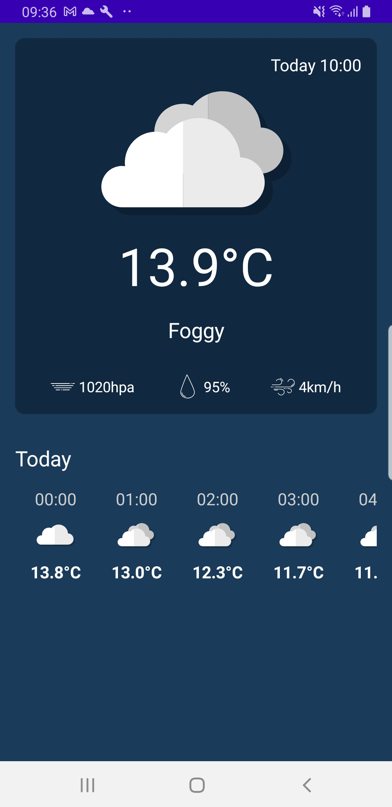

# Stormy-Weather
App to check the weather

## The Brief

App that searches the weater from the api open-meteo. It will user the user's current location to query the api

## Architecture & Libraries
    - MVVM
    - Retrofit
    - Dependency Injection - Dagger-Hilt
    - Kotlin Coroutines
    - Location services

## App preview:

Image #1            |             
:-------------------------:
    | 

